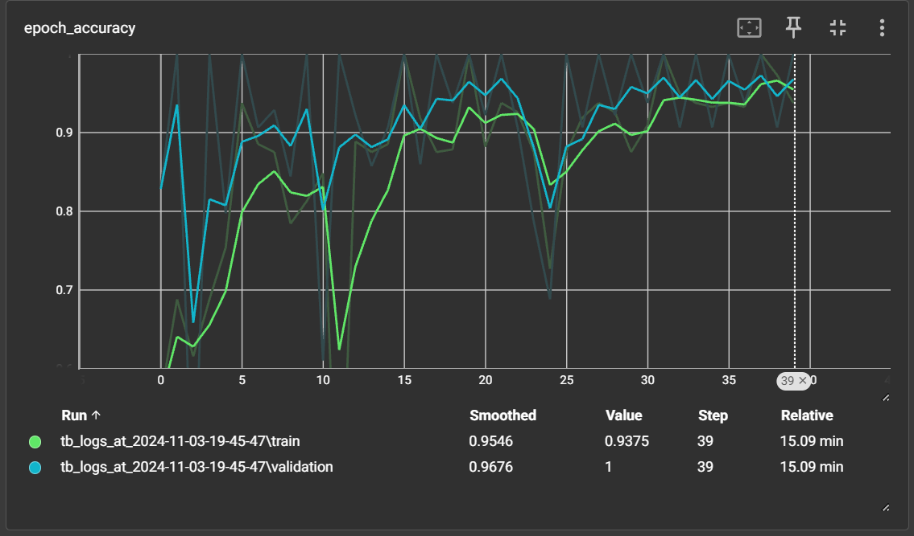

# 🐔 Chicken Disease Classifier

<p align="center">
  
</p>

Welcome to the **Chicken Disease Classifier**! This deep learning project identifies chicken diseases from images, helping to ensure poultry health and early disease detection.

---

## 🌟 Project Overview

The **Chicken Disease Classifier** uses a Convolutional Neural Network (CNN) to diagnose chicken diseases based on fecal images. It enables farmers and veterinarians to proactively control disease spread, contributing to healthier livestock.

---

## 📂 Project Structure

This project is organized into modular directories to make code maintenance seamless and workflows easy to manage. Below is an overview of the structure:

<details>
<summary>🔍 Click to expand the folder structure</summary>

```plaintext
├── .chickenenv/                   # Virtual environment (optional)
├── .dvc/                          # DVC configurations for data version control
├── .github/workflows/             # CI/CD workflows
├── artifacts/                     # Model artifacts and tracked files
│   ├── data_ingestion/            # Data processing and storage
│   │   └── Chicken-fecal-images/  # Image dataset for disease detection
│   ├── prepare_base_model/        # Base model checkpoints
│   ├── prepare_callbacks/         # Callbacks (e.g., checkpoints, TensorBoard logs)
│   └── training/                  # Training outputs and model files
├── config/
│   └── config.yaml                # Configuration settings
├── logs/
│   └── running_logs.log           # Log file for monitoring progress
├── research/                      # Jupyter notebooks for research and prototyping
├── src/                           # Source code for the classifier
│   └── ChickenDiseaseClassifier/  # Project-specific modules
│       ├── components/            # Core modules (e.g., data ingestion, training)
│       ├── config/                # Configurations management
│       ├── constants/             # Constants used throughout the project
│       ├── entity/                # Entity classes for structured data flow
│       ├── pipeline/              # Process pipelines for each step
│       └── utils/                 # Utility scripts
├── templates/
│   └── index.html                 # HTML template for the web app
├── .dvcignore                     # Files to ignore for DVC tracking
├── app.py                         # Flask app for deployment
├── main.py                        # Main script to run the training pipeline
├── Dockerfile                     # Docker configuration for containerization
├── README.md                      # Project documentation
└── requirements.txt               # Project dependencies
```

</details>

---

## 🚀 Getting Started

### 1. Clone the Repository
```bash
git clone https://github.com/mateen-mk/Chicken-Disease-Classification.git
```
```bash
cd ./Chicken-Disease-Classification/
```

### 2. Set Up the Virtual Environment
To avoid dependency conflicts, use a virtual environment:
```bash
python -m venv .chickenenv
```
```bash
.\.chickenenv\Scripts\activate  # On Mac: .chickenenv\bin\activate
```

### 3. Install Dependencies
```bash
pip install -r requirements.txt
```

> 📝 **Note**: Ensure you have the appropriate Python version to match dependencies.

### 4. Set Up Data Version Control with DVC
```bash
dvc init
```

---

## 📄 Configuration Files

### **config/config.yaml**
This file contains core configurations for paths and hyperparameters, such as:
- **IMAGE_SIZE**: Dimensions of the input images.
- **BATCH_SIZE**: Number of samples processed before updating the model.
- **LEARNING_RATE**: Learning rate for training.

### **params.yaml**
Stores model-specific parameters, allowing easy experimentation with different settings.

---

## 🛠 Key Modules

- **`components/`**: Core modules for ingestion, model preparation, callbacks, and training.
- **`config/`**: Manages configuration settings.
- **`constants/`**: Contains constant values used across the project.
- **`entity/`**: Entity classes for managing structured data flow.
- **`pipeline/`**: Scripts for each processing stage.
- **`utils/`**: Contains helper functions.

### 🌐 Web App (Flask-based)

Run the following command to deploy the classifier using the Flask web app:
```bash
python app.py
```
---

## 📈 Model Training & Evaluation

we can train and evaluate the model using the **main.py** script or using the **Data Version Control (dvc)**:

- Using the **main.py** script:
```bash
python main.py
```
- Using **Data Version Control (dvc)**:
```bash
dvc repro
```
It is reccomended to use the **Data Version Control (dvc)** instead of **main.py** script because in any case if you get an error during training and evaluation and the process will fail in the middle of the training, the already trained part will not be repeated in the next attempt.


### **TensorBoard Visualization**
For live model performance tracking, use TensorBoard:
```bash
tensorboard --logdir=artifacts/prepare_callbacks/tensorboard_log_dir
```
<p align="center">
  
</p>

---

## 📝 Research Notebooks

Located in the `research/` directory, these Jupyter notebooks cover various experimental phases, such as:
- **01_data_ingestion.ipynb**: Data collection and preprocessing.
- **02_prepare_base_model.ipynb**: Model architecture and setup.
- **03_prepare_callback.ipynb**: Callback configurations.
- **04_training.ipynb**: Model training experiments.
- **05_model_evaluation.ipynb**: Evaluation and model performance insights.

---

## 🤝 Contributing

We welcome contributions! To contribute:
1. Fork this repository.
2. Create a new branch (`feature-branch`).
3. Commit your changes.
4. Open a pull request.

---

## 🐳 Docker Setup (Optional)

To build and run the Docker container:
```bash
docker build -t chicken_disease_classifier .
docker run -p 5000:5000 chicken_disease_classifier
```

---

## 📬 Contact

For queries or suggestions, reach out via [Mail](mailto:mateenmk2428@gmail.com).

---

## 📜 License

This project is licensed under the MIT License.

---